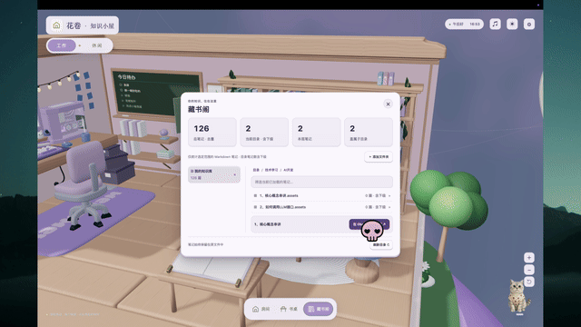

# 花卷 · 知识小屋

把本地知识库搬进一颗可以翻转的 3D 小星球。正面工作，背面休闲。

**[下载 macOS 安装包](https://github.com/wz20/huajuan-knowledge-cottage/releases/latest) · [观看完整演示](https://github.com/wz20/huajuan-knowledge-cottage/releases/download/v0.25.0/demo.mp4) · [Blender 模型](assets/blender/reference-room-v24.blend)**

[](https://github.com/wz20/huajuan-knowledge-cottage/releases/download/v0.25.0/demo.mp4)

## 可以做什么

- **真实知识库看板**：选择 Obsidian 知识库或其中的子目录，查看笔记总量和各子目录统计，搜索、浏览并通过 Obsidian 打开文档。
- **工作面**：待办黑板、最近文档、真实时间电子表、喝水与起身提醒、生活记录。
- **休闲面**：植物浇水、电子琴、背景音乐、打砖块、钓鱼与捕鱼记录、宠物互动。
- **双面星球**：工作／休闲翻转切换，局部镜头、星球全景、日夜主题和减少动态效果设置。
- **本地保存**：SQLite 保存工作台状态；支持备份与恢复，关闭窗口后保留菜单栏。

本项目也是「小白 VibeCoding」的实战案例：从需求、建模和开发，到反复运行与修改。

## 下载与安装

当前版本 **v0.25.0**，提供 **macOS Apple Silicon（M1/M2/M3/M4 等，arm64）** 的 DMG。暂未提供 Intel Mac、Windows 或 Linux 安装包。

1. 打开上方下载链接，下载 `Huajuan-Knowledge-Cottage-0.25.0-arm64.dmg`。
2. 打开 DMG，将「花卷知识小屋」拖到「应用程序」，从应用程序启动。
3. 若要打开知识库文档，先安装 Obsidian，并在 Obsidian 中打开对应仓库，再在小屋书架中添加目录。

安装包目前**未经过 Developer ID 签名与 Apple 公证**。macOS 可能阻止首次打开；确认来自本仓库并核对 SHA-256 后，可按系统提示在「系统设置 → 隐私与安全性」中允许打开。不要关闭系统整体安全保护。校验值在 Release 的 `SHA256SUMS.txt` 中。

## 使用说明

左上角切换工作／休闲，底部入口移动当前面的镜头。点击书架进入知识库，黑板管理待办，电脑查看生活记录，水杯查看喝水情况；池塘鱼篓查看捕鱼记录。右上角调整主题、音乐与设置。

弹琴时按界面提示使用键盘或鼠标。程序内有暂停与退出入口；关闭主窗口不会完全退出，从菜单栏选择退出。

### 数据在哪里

知识文件保留原位，工作台不写入你的 Markdown 内容。目录、待办、提醒和生活记录存放在 Electron `userData` 下的 `workbench.sqlite` 中。备份只覆盖工作台数据库，不包含原始知识库；恢复备份前请确认范围。仓库和安装包不包含作者的个人数据库或知识笔记。

## 本地开发

需要 Node.js **24.13+**、npm，以及 macOS 的 Xcode Command Line Tools（编译 SQLite 原生模块）。依赖版本以 `package-lock.json` 为准。

```bash
git clone https://github.com/wz20/huajuan-knowledge-cottage.git
cd huajuan-knowledge-cottage
npm ci
npm run rebuild:native
npm run dev
```

首次安装会下载 Electron 和 npm 依赖。仅启动网页不能获得本地目录、数据库与 Obsidian 能力，请使用 Electron 开发入口。

```bash
npm run typecheck
npm test
npm run build
```

SQLite 的 Node 与 Electron ABI 不同：在 Electron 原生重建后运行单元测试，如出现 ABI 错误，先执行 `npm rebuild better-sqlite3`；返回 Electron 前再执行 `npm run rebuild:native`。

### 打包 DMG

在 Apple Silicon Mac 上运行：

```bash
CSC_IDENTITY_AUTO_DISCOVERY=false npm run dist:mac
```

产物在 `dist/`。此命令生成未公证的本地安装包；公开的 v0.25.0 DMG 是已有发布构建，不承诺与重新构建的二进制逐字节一致。

## 模型与工程结构

```text
src/main/             Electron 主进程与受限 IPC
src/preload/          窗口桥接
src/worker/           SQLite 与目录扫描
src/renderer/         React 界面与 Three.js 场景
src/renderer/public/  实际加载的 GLB、纹理、音乐
assets/blender/       可编辑 Blender 工程及组件记录
tests/                单元测试
```

应用 v0.25 的知识统计属于代码更新，沿用 **reference-room-v24** 模型。用 Blender 打开 `assets/blender/reference-room-v24.blend` 编辑，导出 GLB 后替换 `src/renderer/public/models/reference-room-v24.glb`。保留 `WorkFace`、`LeisureFace`、`BoardSurface`、`DigitalClockSurface`、`Kirby`、`CanSpoutTip`、`RodTip` 等交互节点名称；改名会影响程序命中与动画。建议另存版本后编辑。

大模型首次克隆需下载约 50 MB GLB 与 32 MB Blender 文件；仓库未包含历史模型与历史安装包。

## 验证与已知限制

发布前已通过 TypeScript 检查、59 项单元测试和生产构建。自动检查不能代替每台设备上的交互、视觉和通知验收。

- 当前为早期公开版本，持续优化模型、性能与交互。
- Obsidian 需本机安装，并能识别所选仓库；系统通知受通知权限和勿扰设置影响。
- 无代码签名、公证；其他 CPU 架构和系统暂未验证。
- 3D 场景会占用一定 GPU 资源，可使用减少动态效果设置。

欢迎通过 Issues 提交复现步骤、设备型号和截图。请勿上传私人笔记或数据库。

## 作者

[GitHub · wz20](https://github.com/wz20) · [花卷 AI 实验室](https://www.douyin.com/search/花卷AI实验室)

## 许可

项目自有代码采用 [MIT](LICENSE)。模型、纹理及其他资源的来源与适用许可见 [资源说明](THIRD_PARTY_NOTICES.md)。
